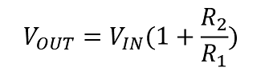

<!-- Please do not change this html logo with link -->

# PIC18F16Q41 Curiosity Nano OPAMP Demonstration Firmware

The PIC18F16Q41 Curiosity Nano Evaluation Kit is preprogramed to demonstrate the OPA module and provide a number of different OPAMP configurations. The OPA configuration depends on the state of  two input pins; RA4 and RA5. Each of these pins is internally pulled high using the Weak Pull-up functionality built into the pad. If left unconnected the corresponding pin will be high and read logic '1'. Connect the pin directly to ground for logic '0'. When updating the OPA configuration, the onboard LED0 will blink a number of times equal to the selected setting. To check the current setting or reconfigure the OPA, press SW0 on the Curiosity Nano board.

</a>

## Related Documentation

* [PIC18F16Q41 Curiosity Nano User Guide](https://microchip.com/DSxxxxxxxxxx) <!-- TODO: Update link once assigned -->
* [PIC18F16Q41 Device Page](https://www.microchip.com/wwwproducts/en/PIC18F16Q41)

## Software Used:
  - MPLAB® X IDE 5.40 or newer [(microchip.com/mplab/mplab-x-ide)](http://www.microchip.com/mplab/mplab-x-ide)
  - MPLAB® XC8 2.20 or a newer compiler [(microchip.com/mplab/compilers)](http://www.microchip.com/mplab/compilers)
  - MPLAB® Code Configurator (MCC) 3.95.0 or newer [(microchip.com/mplab/mplab-code-configurator)](https://www.microchip.com/mplab/mplab-code-configurator)
  - MPLAB® Code Configurator (MCC) Device Libraries PIC10 / PIC12 / PIC16 / PIC18 MCUs [(microchip.com/mplab/mplab-code-configurator)](https://www.microchip.com/mplab/mplab-code-configurator)
  - Microchip PIC18F-Q Series Device Support (1.5.124) or newer [(packs.download.microchip.com/)](https://packs.download.microchip.com/)

## Hardware Used
  - [PIC18F16Q41 Curiosity Nano](https://www.microchip.com/DevelopmentTools/ProductDetails/PartNO/xxxxxxx) <!-- TODO: Update link once assigned -->

## Setup

A brand new PIC18F16Q41 Curiosity Nano comes with the code in this repository pre-programmed onto the device. This demo code can be reprogrammed to the PIC18F16Q41 by copying the hex file onto the CURIOSITY virtual drive that shows up once the Nano Board is plugged into a PC. The entire project can also be accessed using MPLABX 5.40 or newer.

## Operation

The OPA configuration is determined based on the logic levels of pins RA4 and RA5. To select the OPA configuration, pins RA4 and RA5 should be set according to the table below. After setting the pins to match the desired OPA configuration, SW0 must then be pressed to update the OPA module configuration and resume operation. The PIC18F16Q41 operates in sleep mode with the OPA enabled when not being reconfigured.

| RA5 | RA4 | Configuration                                 |  
| --- | --- | ----------------------------------------------|
|  0  |  0  | 1 - Connected directly to external pins       |
|  0  |  1  | 2 - Unity Gain Buffer / Voltage Follower      |
|  1  |  0  | 3 - Non-Inverting Programmable Gain Amplifier |
|  1  |  1  | 4 - Inverting Programmable Gain Amplifier     |

Please note that Weak Pull-ups are enabled on pins RA4 and RA5 in this code example, so unless each pin is directly connected to ground they will read as logic '1' when setting up the OPA module configuration.

### Configuration 1: Connected Directly to External Pins

In this configuration, both of the OPA inputs and the output is connected directly to the corresponding I/O pins. This allows the OPA to be used on its own with external discrete components to provide a feedback network and achieve a specific functionality.

| OPAMP | OPA1IN+       | OPA1IN-       | OUTPUT        |
| ----- | -------       | --------------| ------------- |
| OPA1  | RC3 (OPA1IN1+)| RA2 (OPA1IN2-)| RC2 (OPA1OUT) |

</a>

### Configuration 2: Unity Gain Buffer

In this configuration, the OPA is configured as a unity gain buffer (voltage follower). When configured in this mode, only positive input of the OPA (OPA1IN+) and the output (OPA1OUT) are connected to the external I/O pins, while the negative input of the OPA (OPA1IN-) is internally connected to the output of the OPA as shown in the figure below to form a unity gain buffer.

| OPA   | Positive Input  | Output (OUT)  |
| :----:|:--------------: | :-----------: |
| OPA1  |  RC3 (OPA1IN1+) | RC2 (OPA1OUT) |

</a>

### Configuration 3: Non-Inverting PGA (Programable Gain Amplifier)

In this configuration, the OPA is configured as a non-inverting programmable gain amplifier (PGA) and uses the internal resistor ladder built into the OPA module. The positive input (OPA1IN+) and the output (OPA1OUT) of the OPA are connected to the corresponding I/O pins. The OPA is preconfigured with a gain of '4' using the internal resistor ladder. This gain can be changed by writing a different value to the GSEL bits of OPA1CON1 in the function named "void OPA_NonInverting(void)" located in "application.c".

| OPA    | Gain | Positive Input   | Output (OUT)  |
| :----: | :--: | :--------------: | :-----------: |
| OPA1   |  4   | RC3 (OPA1IN1+)   | RC2 (OPA1OUT) |

</a>

</a>

### Configuration 4: Inverting PGA

In this configuration, the OPA is configured as an inverting programmable gain amplifier (PGA) and used the internal resistor ladder built into the OPA module. The OPA is preconfigured with a gain of '3' using the internal resistor ladder. This gain can be changed by writing a different value to the GSEL bits of OPA1CON1 in the function named "void OPA_Inverting(void)" located in "application.c".

| OPA    | Gain | Positive Input   | Output (OUT)  |
| :----: | :--: | :--------------: | :-----------: |
| OPA1   |  3   | RA2 (OPA1IN2-)   | RC2 (OPA1OUT) |

</a>

</a>
